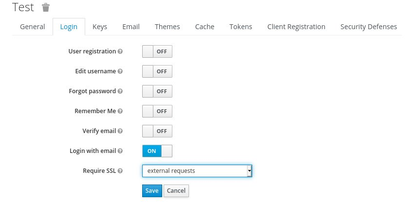
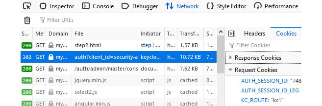
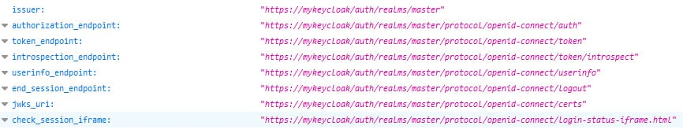

# Lab 6 : Configure Keycloak for production

In this lab, you will be creating a pre-production Keycloak cluster to understand all the different aspects and steps when configuring it for production, such as if you were deploying it in bare metal or in a VM.

## Technical requirements

For this lab, you need to have a local copy of the following directory [this](./setup-keycloak) directory.

To configure a reverse proxy, we are going to use a local domain name other than localhost. This domain name will be used as the public domain name where Keycloak is exposed for your users and applications.

If you are using Linux, you should be able to do that by changing your /etc/hosts file and including the following line:

```

127.0.0.1 mykeycloak

```

Lastly, we are going to use HAProxy as a reverse proxy in front of multiple Keycloak instances. If you are using CentOS or Fedora Linux, you should be able to install HAProxy as follows:

```
$ sudo dnf -y install haproxy
```

All relevant parameters will be explained and they apply to all environments, whether it is containerized, on-premise, GitOps, or Ansible.

## Setting the hostname for Keycloak

Keycloak exposes different endpoints to talk with applications as well as to allow managing the server itself. These endpoints can be categorized into three main groups:

- Frontend
- Backend
- Administration

The base URL for each group has an important impact on how tokens are issued and validated, on how links are created for actions that require the user to be redirected to Keycloak (for example, when resetting passwords through email links), and, most importantly, how applications will discover these endpoints when fetching the OpenID Connect Discovery document from **/auth/realms/{realm-name}/.well-known/openid-configuration**.

In the next steps, we will be looking into each of these groups, how to define a base URL for each one, and the impact it has on users and applications using Keycloak.


### Setting the frontend URL

The **frontend URL** is used to infer the URL used by users and applications to access Keycloak, where the main goal is to logically group all instances of Keycloak in a cluster under a single domain and issuer using a public domain name.

Examples of endpoints in the frontend group include the following:

- An authorization endpoint
- A logout endpoint and others related to session management

By default, Keycloak infers the frontend URL from incoming requests. For example, if you have two Keycloak instances, each one listening on http://10.0.0.5/auth and http://10.0.0.6/auth, Keycloak is going to issue tokens and create links for actions depending on the URL of the instance that is processing the request.

There are several reasons why this default behavior does not work in a production environment.

The most important one is related to the issuer claim in tokens and documents issued by Keycloak. The different instances should be grouped under a single issuer name, otherwise, users and clients will not be able to use them interchangeably because tokens and cookies set by Keycloak will be only valid on the instance where they were created.

Another important aspect is that instances are usually running in a private network. Without setting the frontend URL to match the public domain where Keycloak is exposed, links that redirect users back to Keycloak will be broken, and clients might not be able to make requests based on the endpoints exposed through the OpenID discovery document.

Last but not least, without a frontend URL set, all the benefits you will get from a reverse proxy and clustering are lost.

The expected behavior, however, is that regardless of the node processing the request, the base URL should be the same and aligned with the public domain name where Keycloak is being exposed. By doing that, instances are going to work as if they were one so that users and applications can benefit from all the improvements we will cover later to the general availability, performance, scalability, and failover aspects of Keycloak.

To set the hostname part of the frontend base URL, enter this command:

```
bin/kc.[sh|bat] start --hostname=<value>
```

By setting this property, you are explicitly saying that any Keycloak instance should advertise its endpoints and issue tokens using the **https://mykeycloak/** base URL.

In this section, you learned that setting **hostname-frontend-url** allows you to define the base URL where Keycloak is publicly accessible. You also learned that setting this configuration is crucial to group all instances of Keycloak under a single and logical domain and issuer.

In the next step, we will be looking at how to configure the URL for backend endpoints.

### Setting the backend URL

The backend endpoints are those related to direct communication between Keycloak and applications.

Examples of endpoints in the backend group include the following:

- Token introspection
- User info
- Token endpoint
- JWKS

By default, the backend base URL is also calculated based on the request URL. Usually, you want this URL to be based on a public domain name, so that applications can reach Keycloak from outside its internal network. For that, we configure Keycloak to use the frontend URL as the base URL for backend endpoints.

If you look at the [setup-keycloak/configure-hostname.cli](./setup-keycloak/configure-hostname.cli) file, you should see the following configuration:

```
bin/kc.[sh|bat] start --hostname=<value> --hostname-strict-backchannel=true
```

When all applications connected to Keycloak communicate through the public URL, set **hostname-strict-backchannel** to true. Otherwise, leave this parameter as false to allow internal applications to communicate with Keycloak through an internal URL.

In the next step, you will learn how to set the base URL for the administration endpoints.

### Setting the admin URL

You usually do not want to make the Keycloak Administration Console publicly available. For that, you can set the adminUrl property to force Keycloak to use a specific, private URL:

```
bin/kc.[sh|bat] start --hostname=mykeycloak --hostname-admin=myadminurl
```

By setting the **hostname-admin** property, any URL used by the Admin Console will be based on the value you provided. That said, links and static resources used to render the console will only be accessible using the URL you defined.

Although it makes it difficult to access the console from a network that cannot resolve the domain name or reach the server, you still want to enforce specific rules in your reverse proxy so that the /admin path is fully protected.

In the next step, we will be looking at how to enable TLS so that Keycloak is only accessible through a secure channel.

## Enabling TLS

Any request to and from Keycloak should be done through a secure channel. For that, you must enable HTTP over TLS, also known as HTTPS. In a nutshell, you should never expose Keycloak endpoints through HTTP.

To achieve this, we have 2 options :

### Option 1 : Providing a Java Keystore

The first step to enable HTTPS is to create or reuse a Java KeyStore where the server's private key and certificates are stored. If you are planning to deploy Keycloak in production, you probably have all the key material to enable TLS, as well as your certificates signed by a trusted Certificate Authority (CA).

The next step is to configure the HTTPS listener to use the key material from your Java KeyStore. For that, the following setting can be used :

```
bin/kc.[sh|bat] start --https-key-store-file=/path/to/existing-keystore-file
```

You can also set a secure password for your keystore using the https-key-store-password option:

```
bin/kc.[sh|bat] start --https-key-store-password=<value>
```

If no password is set, the default password **password** is used.

In this file, we are using a Java KeyStore available in the setup folder [setup-keycloak/mykeycloak.keystore](./setup-keycloak/mykeycloak.keystore). This KeyStore was built for example purposes using a self-signed certificate and you should not use it in production. Instead, you should replace it with a KeyStore using your own private key and certificate.


### Option 2 : Providing certificates in PEM format

As an alternative, we can use a pair of matching certificate and private key files in PEM format, you configure Keycloak to use them by running the following command:

```
bin/kc.[sh|bat] start --https-certificate-file=/path/to/certfile.pem --https-certificate-key-file=/path/to/keyfile.pem
```

Keycloak creates a keystore out of these files in memory and uses this keystore afterwards.

If everything is OK, you should be able to access Keycloak at https://localhost:8443, and you should be able to see that the certificate being used comes from your Java KeyStore.

### Bonus : Enforcing HTTPS on a per-realm basis

In addition to enabling HTTPS, Keycloak also allows you to define TLS constraints on a per-realm basis. Basically, for each realm, you can set whether Keycloak should require HTTPS for incoming requests:



By default, Keycloak is going to enforce TLS for any external requests. That means clients using the public network can only access Keycloak through HTTPS.

Ideally, you should set the Require SSL setting to all requests, so that any request to Keycloak is guaranteed to be using a secure protocol.

In the next step, we will be looking at how to configure a production-grade database.

## Configuring a database

By default, Keycloak is configured with a very simple H2 database that should not be used in production, by any means. Instead, you should configure a more robust database such as the following:

- MariaDB 10.1.19
- MariaDB Galera 10.1.19
- MySQL 8.0
- Oracle 19c RAC
- Microsoft SQL Server 2017
- PostgreSQL 11.5

In this lab, you are going to configure a PostgreSQL database. The same steps should work for any other database you choose.

To configure a database, a few steps are needed:

- Installing a module on the Keycloak server with the Java Database Connectivity (JDBC) driver for the database
- Configuring the JDBC driver so that it can be used by Keycloak
- Configuring Keycloak to connect to the database using a valid URL, username, and password

To configure Keycloak to use PostgreSQL you issue the following command:

```
$ bin/kc.sh build --db postgres
```

Then, you have to add the following database connection options to the start command:

`–db-url-host=127.0.0.1` : the database hostname or IP address
`–db-url-database=keycloak` : the name of the database to use
`–db-username=keycloak` : the user authorized to connect to the database
`–db-password=keycloak` : the corresponding password for the user


In addition to these basic settings to connect to an external database, there are other settings you should consider before going to production. Probably one of the most important ones, the size of the connection pool should be sized according to the load you expect in your system, and how many concurrent requests should be allowed at a given point in time.

By default, the pool is configured with a max of 20 connections. This value should be enough for most deployments, but if you are facing errors in logs due to connections not available in the pool when under an unexpected load, you may change the pool size by running the following CLI command:

```
db.pool.min-size=30
db.pool.max-size=30
```

In the preceding example, we are increasing the pool size to a maximum (max-pool-size) of 30 connections. We are also defining the minimum size (min-pool-size) with the same value. The reason for that is that creating new connections is expensive and keeping a minimum value of 30 connections helps to make sure connections are always available during the server's lifetime.

In this section, you learned about the basic steps to configure a production-grade database in Keycloak. You also learned about the different databases you can use based on the list of supported databases.

In the next step, you will learn about how to configure Keycloak for high availability, starting with the necessary configuration to configure a reverse proxy or load balancer.

## Enabling clustering

Keycloak is designed for high availability, where, in addition to the persistent data kept in the database, it also uses a cache layer to replicate and keep state in-memory for fast data access. This cache layer is built on top of Infinispan, a high-performance key-value in-memory data store.

To enable clustering and full high availability, you should do the following:

- Run the server using a high-availability configuration profile.
- Make sure the reverse proxy is configured to distribute load across the different instances.

To run multiple Keycloak instances and build a cluster, you basically need to run the server as follows:

```
$ cd $KC_HOME
$ bin/kc.sh start --https-certificate-file=./tls/mykeycloak+1.pem --https-certificate-key-file=./tls/mykeycloak+1-key.pem --hostname=mykeycloak:8443 --hostname-strict-backchannel=true
```

This command will start the first instance in our cluster. The server will be listening on the default ports and you should be able to access it at http://localhost:8443.

Let's now start a second instance by specifying a different port offset using the jboss.socket.binding.port-offset system property. This property is going to allow us to run the second instance within the same host without conflicting with the first instance that is listening on the default ports. This is achieved by increasing by 100 the number of each port used by Keycloak so that instead of listening on the default HTTPS 8443 port, the server will be available at http://localhost:8543/auth:

```
$ cd $KC_HOME
$ bin/kc.sh start --https-certificate-file=./tls/mykeycloak+1.pem --https-certificate-key-file=./tls/mykeycloak+1-key.pem --hostname=mykeycloak:8543 --hostname-strict-backchannel=true
```

Now, perform the same steps to start the third node as follows:

```
$ cd $KC_HOME
$ bin/kc.sh start --https-certificate-file=./tls/mykeycloak+1.pem --https-certificate-key-file=./tls/mykeycloak+1-key.pem --hostname=mykeycloak:8643 --hostname-strict-backchannel=true
```

After executing this last command, you should now have three Keycloak instances running on ports 8443, 8543, and 8643, respectively.

Keycloak runs on top of JGroups and Infinispan, which provide a reliable, high-availability stack for a clustered scenario. When deployed to a cluster, the embedded Infinispan server communication should be secured. You secure this communication either by enabling authentication and encryption or by isolating the network used for cluster communication.

Keycloak provides a cache configuration file with sensible defaults located at $KC_HOME/conf/cache-ispn.xml. The cache configuration is a regular Infinispan configuration file.

By looking at the $KC_HOME/conf/cache-ispn.xml file, you should see the following cache definitions: :

```xml
<distributed-cache name="sessions" owners="1"/>
<distributed-cache name="authenticationSessions" owners="1"/>
<distributed-cache name="clientSessions" owners="1"/>
<distributed-cache name="actionTokens" owners="2">
   <object-memory size="-1"/>
      <expiration interval="300000" max-idle="-1"/>
</distributed-cache>
```

Depending on your availability and failover requirements, you might want to increase the number of owners – the nodes where state is replicated – to at least 2 so that state is replicated to 2 nodes in the cluster. By increasing the number of owners, Keycloak can survive up to 1 node failure without losing any state. To find out more about using multiple nodes, the different caches and an appropriate stack for your environment, see the [Configuring distributed caches](https://www.keycloak.org/server/caching) guide.

## Configuring a reverse proxy

Keycloak can be used with any reverse proxy implementation so you are free to use whatever you are comfortable with. Examples of widely used reverse proxies are Apache HTTP Server, Nginx, F5, and HAProxy.

Regardless of your preference, there is a set of basic requirements that you should be aware of to use your choice with Keycloak:

- TLS termination and re-encryption
- Load balancing
- Session affinity
- Forwarding headers

Some of these requirements are intrinsic to the concept of a reverse proxy and are supported by the different implementations.

For this lab, we are going to use the haproxy.cfg file available at [setup-keycloak/haproxy/haproxy.cfg](./setup-keycloak/haproxy/haproxy.cfg).

In the next steps, we will be looking at each of the requirements mentioned herein and how to address them using HAProxy.

### Distributing the load across nodes

In our HAProxy configuration, the configuration related to load balancing is the following:

```
balance roundrobin
server kc1 127.0.0.1:8443 check ssl verify none cookie kc1
server kc2 127.0.0.1:8543 check ssl verify none cookie kc2
server kc3 127.0.0.1:8643 check ssl verify none cookie kc3
```

### Forwarding client information

When running behind a reverse proxy, Keycloak does not talk directly to the client that originated the request, but rather to the reverse proxy itself. This fact has an important consequence for how Keycloak obtains information about the client, such as the IP address.

To overcome this limitation, reverse proxies should be able to forward specific headers to provide Keycloak information about the client where the request originated from. The main headers Keycloak requires from proxies are the following:

- **X-Forward-For**: A header indicating the address of the client where the request originated from
- **X-Forward-Proto**: A header indicating the protocol (for example, HTTPS) that the client is using to communicate with the proxy
- **Host**: A header indicating the host and port number of the proxyTipSpecial care should be taken when making sure the proxy is setting all these headers properly, and not just forwarding these headers to Keycloak if they are sent by clients.

On Keycloak, the configuration you need to integrate with a proxy is quite simple. Basically, you need to enable the proxy mode by using the following command:

```
bin/kc.[sh|bat] start --proxy <mode>
```

We are going to select the **reencrypt** mode in order to encrypt the communication between the reverse proxy and Keycloak.

On the reverse proxy side, we have the following configuration defined:

```
option forwardfor
http-request add-header X-Forwarded-Proto https
http-request add-header X-Forwarded-Port 443
```

This configuration will make sure that HAProxy sets the mentioned headers so that Keycloak can obtain information about clients making the requests.

## Keeping session affinity

Another important configuration you should consider is how the proxy is going to respect session affinity. Session affinity is about the proxy using the same backend node to serve requests to a particular client. This capability is especially useful when clients are using flows that require multiple interactions with Keycloak, such as when using the user agent to authenticate users through the authentication code flow.

As you learned in the Enabling clustering section, Keycloak tracks state about user and client interactions with the server. This state is kept in in-memory caches and shared across different nodes in the cluster. Session affinity helps to minimize the time taken by Keycloak to look up data on these caches, where clients connecting to these nodes do not need to look up data on other nodes in the cluster.

To configure session affinity, Keycloak.X provides the following setting :
 

- ```spi-sticky-session-encoder-infinispan-should-attach-route``` : If the route should be attached to cookies to reflect the node that owns a particular session.

When it's enable (by default), Keycloak is going to rely on the proxy to keep session affinity between clients and backend nodes.

Now, on the reverse proxy side, we have the following configuration to guarantee that clients are tied to a specific node:


```
cookie KC_ROUTE insert indirect nocache
```

With the preceding configuration, HAProxy is going to set a **KC_ROUTE** cookie where its value is the first node that the client made the request to. Subsequent requests from the same client will always be served by the same node.


## Testing your environment

### Testing load balancing and failover

Firstly, try to access Keycloak at https://mykeycloak and log in to the administration console.

Depending on the browser you are using, you should be able to see which backend node is serving your requests. In Firefox, you can open the development tools and look at the cookies sent by your browser when making requests to Keycloak:



Your browser should be sending a KC_ROUTE cookie where its value is the node chosen by the reverse proxy to indicate which Keycloak instance should be serving that request. From the preceding screenshot, requests should be forwarded to kc1.

Now, try to shut down the Keycloak instance that was started using the jboss.node.name system property set to kc1. If you see a different value for the KC_ROUTE cookie, you need to shut down the corresponding node.

After shutting down the node, try to refresh the administration console page. If everything is properly configured, you should still be able to access the administration console without having to authenticate again. That is only possible due to teamwork between both the reverse proxy and Keycloak, where Keycloak makes sure data is replicated across instances, and the reverse proxy is able to transparently forward requests to another node.

### Testing the frontend and backchannel URLs
Lastly, let's check the OpenID Discovery document and look at how Keycloak is exposing its endpoints. For that, open Keycloak at https://mykeycloak/auth/realms/master/.well-known/openid-configuration. As a result, you get a JSON document as follows:



If everything is set correctly, you should see that, regardless of the node serving the request, Keycloak will advertise all its endpoints using the https://mykeycloak/auth base URL.

## Summary

In this lab, we covered the main steps to configure Keycloak for production. With the information provided herein, you should now be aware of the main steps and configuration to successfully deploy Keycloak for high availability. You learned that when deploying Keycloak in production, you should always use a secure channel using HTTPS, as well as the importance of setting up the hostname provider to configure how Keycloak issues tokens and exposes its endpoints through the OpenID Connect Discovery document. You also learned about the importance of using a production-grade database and its impact on the overall performance and availability of Keycloak, as well as on data consistency and integrity. Lastly, you learned how to configure and run a cluster with multiple Keycloak instances and how to use a reverse proxy to distribute load across these instances.
