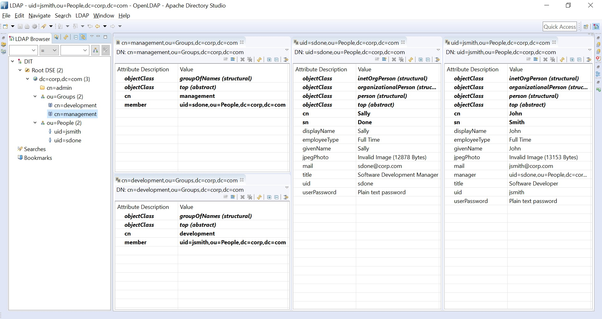
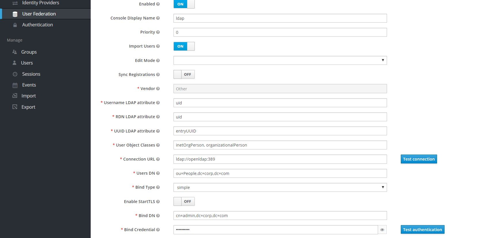
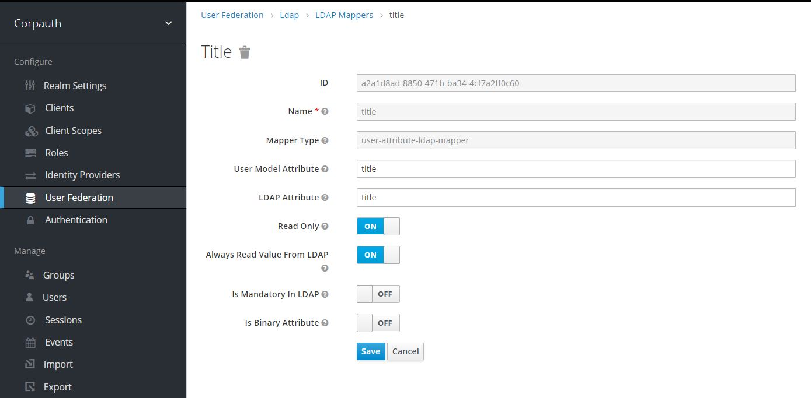
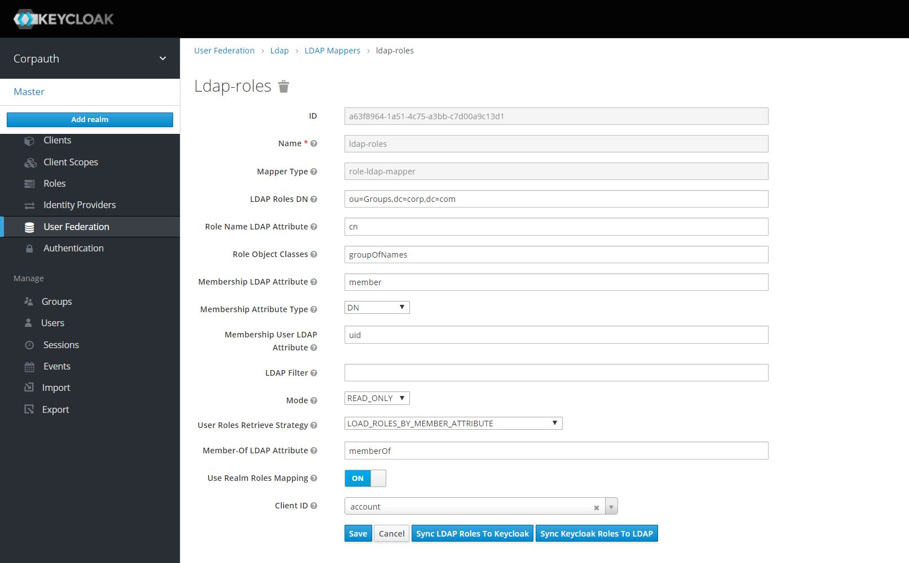
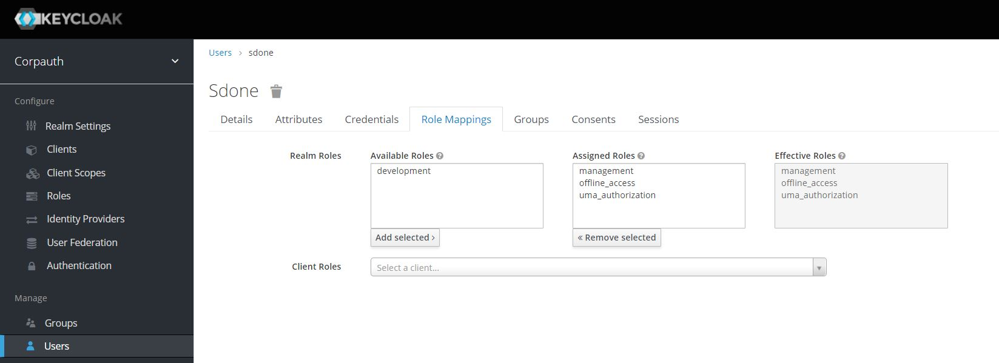

# Lab 7 : User federation using LDAP

For this lab we are going to use Openldap as a user provider.

We are going to use docker images for both Keycloak and LDAP service, but first we need to create a docker network so they can communicate together :

```bash
$ docker network create ldap_keycloak
```

Then we start ou keycloak instance by adding the --network switch :

```bash
$ docker run --name keycloak -p 8080:8080  \
    -e KEYCLOAK_ADMIN=admin -e KEYCLOAK_ADMIN_PASSWORD=admin \
    --network ldap_keycloak \
    quay.io/keycloak/keycloak:18.0.1 \
    start-dev
```

Open a new terminal tab, and from the current directory of this lab, execute the following docker command to spin up a ready-to-use LDAP server :

```bash
docker run --env LDAP_ORGANISATION="The Corporation" --env LDAP_DOMAIN="corp.com" --env LDAP_ADMIN_PASSWORD=admin --network ldap_keycloak --mount type=bind,source="$(pwd)"/data,target=/home/data -p 389:389 -p 636:636 --name openldap osixia/openldap:1.3.0
```

The project uses a sample [user database](./ldap/conf/ldap_data.ldif) that can be imported as follows (from a new terminal tab) :

```bash
docker exec openldap ldapadd -x -H ldap://localhost -D "cn=admin,dc=corp,dc=com" -w admin -f /home/data/ldap_data.ldif
``` 

LDAP view:


## Directory Server Integration

Let's now configure an existing realm to use our new LDAP server. This can be done via `User Federation` menu of Keycloak in left hand side then using `Add    Provider --> ldap`. A sample configuration is as follows:




The sample configuration enables Keycloak to use OpenLDAP server as user base with a designated synchronization policy defined under `Sync Settings`. In order to perform a force synchronization `Synchronize all users` button under that page should be used. As sample LDAP user entities contains title and photo attributes LDAP mappers with the type of `user-attribute-ldap-mapper` should be set in Keycloak. The `Mappers` tab under the same page:




These mappings should also done for client created in order to retrieve these user attributes via `/userinfo` endpoint. This can be done under `Mappers` tab using `Create` button on relevant client definition page:  


## Roles

Roles and scopes are used to classify and control access to resources. Roles and scopes can be used by resource server to decide whether request to access a resource (API call) is authorized. For this project we only use LDAP based roles not scopes for authorization.

In order to use LDAP as a base for role definitions a new LDAP mapper with the type of `role-ldap-mapper` should be added under defined User Federation setting of LDAP. A sample configuration applies to our pre-defined user database is as follows:



Clicking ``Sync LDAP Roles To Keycloak` adds LDAP group names as roles to Realm level role list per the sample configuration above and LDAP based user-role assignments take place:





