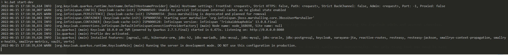

# Setup : Installing and running Keycloak

Keycloak provides a few options on how it can be installed, including the following:

- Running as a container on Docker
- Installing and running Keycloak locally (which will require a Java virtual machine, such as OpenJDK)
- Running Keycloak on Kubernetes
- Using the Keycloak Kubernetes operator

If you already have Docker installed on your workstation, this is the recommended approach as it is simpler to get up and running this way.

If you don't have Docker installed, it is easier to get started by installing and running it locally. The only dependency required is a Java virtual machine.

Keycloak can also be easily deployed to Kubernetes, where you have the option of using the Keycloak Kubernetes Operator, which makes installation, configuration, and management even simpler. We are not going to provide instructions for Kubernetes in this training, as we instead want to focus on Keycloak and its features. If you are interested in knowing how to run Keycloak on Kubernetes, then the Keycloak website provides great Getting started guides at https://www.keycloak.org/getting-started/getting-started-kube.

In the next section, we will look at how you can run Keycloak as a container on Docker. If you prefer to run it locally, you can skip to the section titled Installing and running Keycloak with OpenJDK.

## Running Keycloak on Docker

To run Keycloak on Docker, simply execute the following command:

```
$ docker run --name keycloak -p 8080:8080  \
    -e KEYCLOAK_ADMIN=admin -e KEYCLOAK_ADMIN_PASSWORD=admin \
    quay.io/keycloak/keycloak:20.0.1 \
    start-dev
```

As expected, the container will run in development mode.

In this mode, some key configuration options are set to make it possible to start the server for development purposes without the burden of having to define additional settings that are mandatory for production.

As Keycloak does not ship with a default admin account, passing the environment variables, KEYCLOAK_USER and KEYCLOAK_PASSWORD, makes it easy to create an initial admin account. We are also using –p 8080 to publish the port used by Keycloak to the host, so as to make it easy to access Keycloak.

After a few seconds, you will see a message along the lines of the following, meaning Keycloak has started successfully :



You can verify that Keycloak is running by opening http://localhost:8080.

You can also define the following alias to use the [Admin CLI](https://www.keycloak.org/docs/latest/server_admin/index.html#admin-cli) :

```
$ mkdir -p $(echo $HOME)/.acme/.keycloak
$ alias kcadm="docker run --net=host -i --user=1000:1000 --rm -v $(echo $HOME)/.acme/.keycloak:/opt/keycloak/.keycloak:z --entrypoint /opt/keycloak/bin/kcadm.sh quay.io/keycloak/keycloak:19.0.1"

```

Congratulations! You now have Keycloak running as a Docker container and can get started with trying Keycloak out by first discovering the Keycloak admin and account consoles.


 ## Installing and running Keycloak with OpenJDK
 
 As Keycloak is implemented in Java, it is easy to run Keycloak on any operating system without the need to install additional dependencies. The only thing that you need to have installed is a Java virtual machine, such as OpenJDK.
 
 In the next section, we will install OpenJDK, which is required before running Keycloak. If you already have a Java virtual machine installed, you can skip the next section and go directly to the section entitled Installing Keycloak.
 
 ### Installing OpenJDK
 The best way of installing OpenJDK depends on the operating system you are using. Most Linux distributions, for example, include OpenJDK packages in the default repositories.
 
 By way of an example, on Fedora, you can install OpenJDK by executing the following command:
 
```
$ sudo dnf install java-latest-openjdk
```

For instructions specific to your operating system, use one of the following URLs to find the relevant instructions:

- Windows: https://www.google.com/search?q=install+openjdk+windows
- macOS: https://www.google.com/search?q=install+openjdk+macos
- Ubuntu: https://www.google.com/search?q=install+openjdk+ubuntu

Another simple way to install OpenJDK is to download one of the ready builds at https://jdk.java.net/. Open this page in your browser and then click on the JDK 15 link next to Ready for use. Download the build for your operating system, and then extract it to a suitable location. Once extracted, set the JAVA_HOME environment variable to point to the extracted directory.

The following commands shows an example of installing a ready build of OpenJDK on Linux:

```
$ mkdir ~/kc
$ cd ~/kc
$ tar xfvz ~/Downloads/openjdk-11.0.2_linux-x64_bin.tar.gz
$ export JAVA_HOME=~/kc/jdk-11.0.2
$ $JAVA_HOME/bin/java -version
```

The last command `java –version` verifies that Java is working properly.

Now that you have OpenJDK installed, we will move on to installing Keycloak.

Before starting Keycloak, we will create an initial admin account.

Creating an admin account
Keycloak does not ship with a default admin account. This is to prevent anyone from running Keycloak with a default username and password in production.

This means that prior to using Keycloak, you need to create an initial admin account.

To create an admin account on Linux or macOS, execute the following command in a terminal to set the username and password for this account:

```
$ export KEYCLOAK_ADMIN=admin; export KEYCLOAK_ADMIN_PASSWORD=change_me
```

On Windows, execute the following command:

```
> set KEYCLOAK_ADMIN=admin; set KEYCLOAK_ADMIN_PASSWORD=change_me
```

***Important note :*** For production systems, you should obviously use a more secure password, including strongly considering using strong authentication, especially for the admin account. Later in the training, we will cover how you can easily enable two-factor authentication with Keycloak.

You are now ready to start Keycloak, which we will cover next.

### Starting Keycloak

Once you launch Keycloak, it will automatically create your admin account based on the values definded in the environment variables :

On Linux or macOS, start Keycloak with the following command:

```
$ cd $KC_HOME
$ bin/kc.sh start-dev
```

Or, on Windows, execute the following command:

```
> cd %KC_HOME%
> bin\kc.bat start-dev
```

After a few seconds, you will see a message that confirms that Keycloak has started successfully

You can verify that Keycloak is running by opening http://localhost:8080.


Congratulations! You now have Keycloak running on your workstation and can get started with trying Keycloak out by first discovering the Keycloak admin and account consoles. See you in the next lab !
